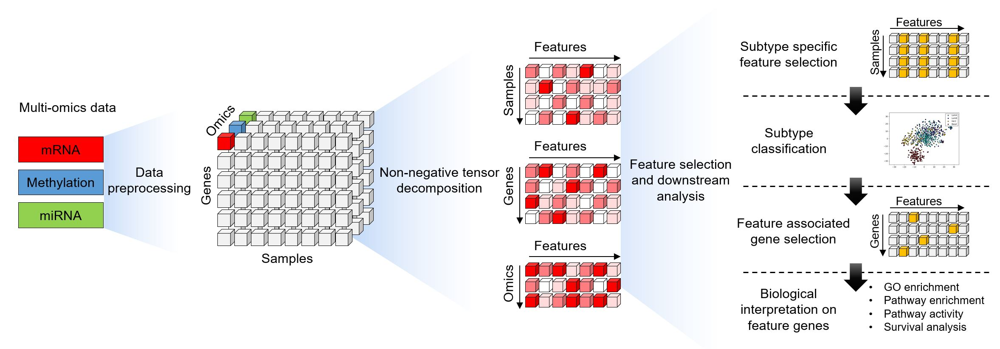

# MONTI: A Multi-Omics Non-negative Tensor decomposition framework for the Integrated analysis of large cancer cohorts

Multi-omics data is frequently measured to characterize biological mechanisms underlying phenotypes. Complex relationships in multi-omics data, if mined, can lead to more accurate classification of patient samples according to the phenotypes.

MONTI (Multi-Omics Non-negative Tensor decomposition for Integrative analysis) is a tool that can be used to integrate and analyze large sets of multi-omics data. MONTI identifies gene regulatory multi-omics features specific to a group of samples that share a common biological trait.

Below is an illustration of the analysis workflow of MONTI.


The output of MONTI is a simple gene list with information of their associated subtypes, which can be used for further downstream analysis. For example, the Venn diagram below shows the genes that are found to be associated to colorectal cancer subtypes CMS1, CMS2, CMS3 and CMS4. These genes showed to be informative in separating the four subtypes as shown in the t-SNE plot.
<!---->


---

## Installing MONTI

### Prerequisites
* Python version>=3.6 is required
* The python modules below are required which can be installed manually or using the `install_monti.py` script
  * `tensorly`, `argparse`, `joblib`, `matplotlib`, `lifelines`, `seaborn`

## Running MONTI

The input to MONTI are gene-centric omics matrices. The omics matrices must be of the same dimensions, which are matrices of _m x n_. Here, _m_ is the number of genes and _n_ the number of patients. Hence, every omics data are bundled into units of genes to generate a gene-centric matrix.

Assuming that the omics are processed into gene-centric format, each omics data are further pre-processed. This can be using the `samp_to_mat.py` code, which compiles omics into patient matched data and normalizes data accordingly. For example, if mRNA, methylation and miRNA omics data are given, patients with all the three omics data are selected, which will serve as the data used by MONTI. The output of `samp_to_mat.py` is the input data used by MONTI. Users may prepare their own omics data.


```bash
usage: samp_to_mat.py [-h] -i OMICS1_FILE OMICS2_FILE OMICS3_FILE ... -s SAMPLE_INFO -g GENE_INFO
	[-l GROUP_LABEL] [-o OUTDIR]

# mandatory arguements
-i: the omics matrices in CSV format
-s: a two column text file that contains sample IDs and their clinical features (e.g., subtype)
-g: a two column text file including the genes to be used (by default a list or 14K protein coding genes are provided)

# optional arguements
-l: the label of the group (just an indicator)
-o: the output path
```

```bash
usage: monti.py [-h] -f INPUT_FILE -r RANK -s SAMPLE_INFO -g GENE_INFO
	[-surv SURVIVAL_INFO] [-o OUTDIR] [--plot]
	[--dmax_iter DMAX_ITER] [--alpha ALPHA]
	[-pre PREPROCESS_DIR]

# mandatory arguements
-f: the input tensor data (a numpy ndarray)
-r: the number of ranks which the tensor is to be decomposed
-s: a two column text file that contains sample IDs and its associated breast cancer subtype
-g: a two column text file including the genes to be used (by default a list or 14K protein coding genes are provided)

# optional arguements
--damx_iter: the number of maximum iterations during tensor decomposition (default: 300)
--alpha:	 the L1 penalty weight (default: 0.01)
--plot:	 for drawing gene plots
-o:	 the output directory name (default: 'output')
```

## Reproducing results in the paper

Due to the nature of selecting features include some randomness (repeated 10-fold cross validation, random splitting of test and train samples), the results from our study cannot be completely reproduced. However, the variance should not be significant.

To reproduce the results in our study, please follow the instructions below.
### Execute MONTI using the previously decomposed components
  ```bash
  python3 monti.py -f inputdata/tensor_BRCA_log2_qnormalized_scaled.npy -r 450 -s inputdata/sample_info.txt --plot -o output_paper
  ```

### The following result files can be found under the "output_paper" directory
	> sample_features_r450.txt: the breast cancer subtype associated patient features
	> feature_genes_r450.txt: the feature associated genes
	> accuracy_patients_r450.txt: the classification accuracy using patient features
	> accuracy_genes_r450.txt: the classification accuracy using feature genes
	> survival_patients_plot.pdf: survival plots using patient features
	> survival_genes_plot.pdf: survival plots using feature genes
	> patient_models/: the MLP classification models generated using the patient features
	> gene_models//: the MLP classification models generated using the gene features
	> plots/: 
		> gene_plots_<subtype>.pdf: multi-omics scatter plot of the <subtype> associated genes
		> sample_tSNE.pdf: the t-SNE plot using patient features

---

## Using the STAD data

### Generate input data for MONTI
```bash
monti_input_dir="dataset/STAD/inputdata"
bin/samp_to_mat.py -i dataset/STAD/data/omics_STAD_gene_genecentric.csv dataset/STAD/data/omics_STAD_meth450_genecentric.csv dataset/STAD/data/omics_STAD_mirna_genecentric.csv -s dataset/STAD/subtype_info.txt -r subtype -g dataset/gene_info_withheader.txt -o $monti_input_dir
```

### running MONTI
```bash
rank=150	# number of ranks (features)
monti_outputdir="dataset/STAD/output"
bin/monti.py -f $monti_input_dir/tensor.subtype.npy -s $monti_input_dir/sampinfo_subtype.txt -g $monti_input_dir/geneinfo_subtype.txt -r $rank -o $monti_outputdir --plot
```

## Using the COAD data

### Generate input data for MONTI
``` bash
monti_input_dir="dataset/COAD/inputdata"
bin/samp_to_mat.py -i dataset/COAD/data/omics_COAD_gene_genecentric.csv dataset/COAD/data/omics_COAD_meth450_genecentric.csv dataset/COAD/data/omics_COAD_mirna_genecentric.csv -s dataset/COAD/data/subtype_info.txt -r subtype -g dataset/gene_info_withheader.txt  -o $monti_input_dir
```

### running MONTI
``` bash
rank=150
monti_outputdir="dataset/COAD/output"
bin/monti.py -f $monti_input_dir/tensor.subtype.npy -s $monti_input_dir/sampinfo_subtype.txt -g $monti_input_dir/geneinfo_subtype.txt -r $rank -o $monti_outputdir --plot
```
